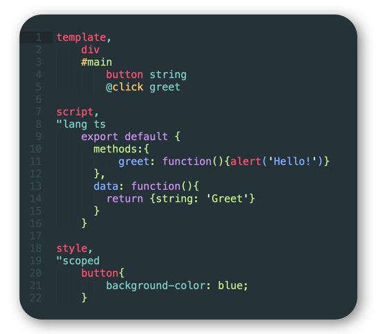

# Louk Grammar
Syntax highlighting for [Louk](https://www.louk-lang.org)

## Installation
Install from the [Visual Studio Marketplace](https://marketplace.visualstudio.com/items?itemName=louk-lang.louk), or search for `louk` in the VS Code extensions manager (`⌘+shift+x` on Mac, `ctrl+shift+x` on Windows).

## About
This package/repository is purely a distribution mechanism for build outputs from the [louk-grammar](https://github.com/agorischek/louk-grammar) repository. Contributions and modifications should be made in that repository.

